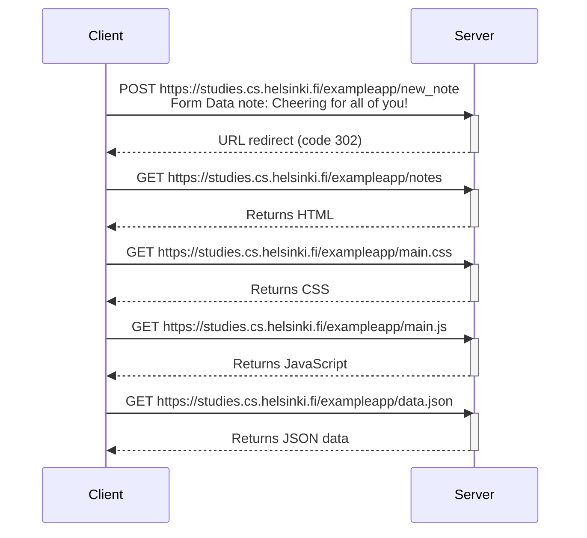

# Diagram of creating a new note

User enters text on client browser and presses the "Save" button. During this interaction, the following HTTP exchange occurs.

### Sequence diagram of client(browser)-server interaction

