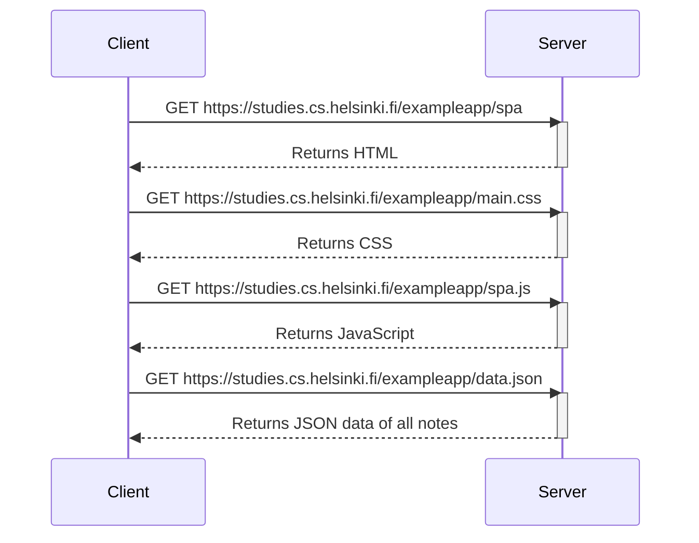

# Single Page App Diagram

The following HTTP exchange occurs as the user loads the website.

### Sequence diagram of client(browser)-server interaction

```mermaid
sequenceDiagram
participant Client
participant Server
Client->>Server: GET https://studies.cs.helsinki.fi/exampleapp/spa
activate Server
Server-->>Client: Returns HTML
deactivate Server
Client->>Server: GET https://studies.cs.helsinki.fi/exampleapp/main.css
activate Server
Server-->>Client: Returns CSS
deactivate Server
Client->>Server: GET https://studies.cs.helsinki.fi/exampleapp/spa.js
activate Server
Server-->>Client: Returns JavaScript
deactivate Server
Client->>Server: GET https://studies.cs.helsinki.fi/exampleapp/data.json
activate Server
Server-->>Client: Returns JSON data of all notes
deactivate Server
```

