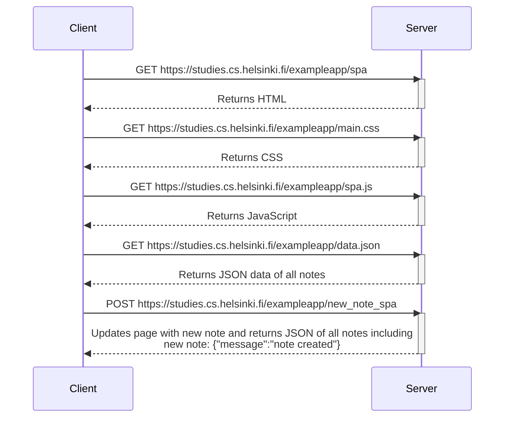

# Single Page App Diagram - Creating a New Note

The following HTTP exchange occurs as the user loads the website and then enters text on the client browser.

### Sequence diagram of client(browser)-server interaction

